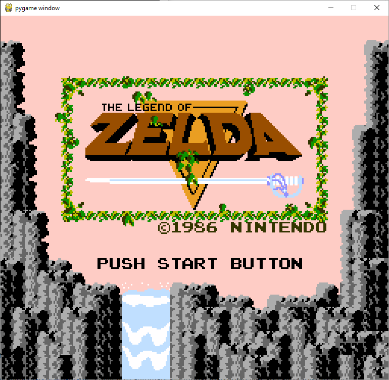

# Cal-NES
An NES Emulator started during Calhacks 4.0 that I continued on my own. 

# Zelda Screen Test ROM 

  

# Features
- ROM Load
- Emulated 6502 CPU
- PPU Emulation
- Base Mappers

[Original Repo](https://github.com/dvendrow/Cal-NES)
